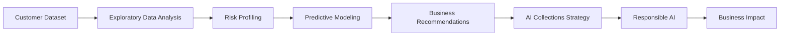
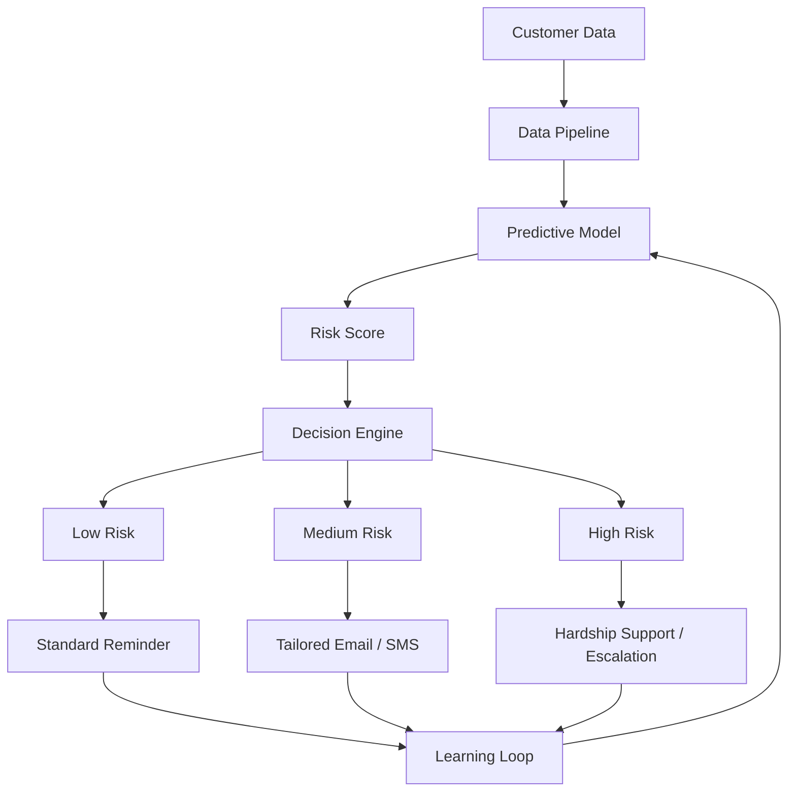

<p align="center">

# 💳 AI-Powered Credit Card Delinquency Prediction & Autonomous Collections Strategy

### *Tata iQ GenAI Powered Data Analytics — Forage Virtual Experience*

*A simulated AI transformation consulting engagement for Geldium Finance*

<br>


-CADCFC?style=for-the-badge&logoColor=black)


</p>

<p align="center">
  <a href="#-project-overview">Overview</a> •
  <a href="#-business-problem">Problem</a> •
  <a href="#-key-findings">Findings</a> •
  <a href="#-ai-collections-system-architecture">Architecture</a> •
  <a href="#-project-deliverables">Deliverables</a> •
  <a href="#-technology-stack">Tech Stack</a>
</p>

<p align="center">

📄 <a href="docs/Task1_EDA_Summary_Report.pdf">EDA Report</a> •
📈 <a href="docs/Task2_Predictive_Model_Plan.pdf">Predictive Model</a> •
📑 <a href="docs/Task3_Business_Summary_Report.pdf">Business Report</a> •
📊 <a href="presentation/Task4_AI_Collections_Strategy.pptx">Presentation</a>

</p>

---

## 📌 Project Overview

This repository contains my submission for the **Tata iQ GenAI Powered Data Analytics Virtual Experience Program** on **Forage**.

In this simulated consulting engagement, I worked as an **AI Transformation Consultant** to help **Geldium Finance** address rising credit card delinquency through data analytics, predictive modeling, business recommendations, and an AI-powered collections strategy.

> **Note:** This project is based on a **simulated business case and dataset** provided by the Forage virtual experience. All findings and recommendations are derived from that dataset.

---

## 🎯 Business Problem

Geldium Finance is experiencing increasing credit card delinquency due to:

| Challenge | Impact |
|---|---|
| Manual collections processes | Slow, inconsistent outreach |
| Static customer segmentation | Misses compounding risk factors |
| Reactive customer outreach | Interventions arrive too late |
| Limited personalization | One-size-fits-all messaging |
| Inefficient prioritization | High-risk customers not flagged early |

**Project Objectives**

- Analyze customer data through Exploratory Data Analysis (EDA)
- Identify major delinquency risk factors
- Design a predictive modeling approach
- Develop business recommendations
- Propose an AI-powered autonomous collections framework
- Ensure Responsible AI and regulatory compliance

---

## 🔄 Project Workflow



---

## 📊 Key Findings

This project intentionally reports the analytical results exactly as observed — even when they are weaker than expected.

| Finding | Result |
|---|---|
| Dataset Size | 500 customers |
| Delinquency Rate | 16.0% |
| Missing Values | Income (7.8%), Loan Balance (5.8%), Credit Score (0.4%) |
| Data Quality Issues | Employment Status inconsistencies, Credit Utilization >100% |
| Strongest Risk Segment | Unemployed + DTI ≥ 35% → **30.4% delinquency** (n=23) |
| Logistic Regression Performance | Mean ROC-AUC = **0.44** |

> **Key observation:** The predictive model demonstrated limited predictive performance (AUC = 0.44). Instead of overstating the model's capability, this project recommends using **transparent, segment-based business rules with human oversight** until a stronger predictive model can be developed on larger production datasets.

## 📈 Project Outcome

Although the Logistic Regression model achieved a modest ROC-AUC of **0.44**, the project successfully identified meaningful business segments through exploratory and combined-segment interaction analysis.

Rather than recommending deployment of an unreliable predictive model, the final solution proposes a transparent, human-supervised collections strategy using high-risk customer segmentation supported by Responsible AI principles.

---

## 🏗 AI Collections System Architecture



---

## 🤖 Agentic AI Workflow

<table>
<tr>
<td valign="top" width="50%">

**🟢 Autonomous Activities**
- Customer monitoring
- Risk prediction
- Personalized reminders
- Continuous learning
- Recommendation generation

</td>
<td valign="top" width="50%">

**🔴 Human Oversight Required**
- Hardship approval
- Debt restructuring
- Compliance review
- Legal escalation
- High-impact decisions

</td>
</tr>
</table>

---

## 📁 Repository Structure

```
Tata-GenAI-Credit-Card-Delinquency-Prediction
│
├── README.md
│
├── docs/
│   ├── Task1_EDA_Summary_Report.pdf
│   ├── Task2_Predictive_Model_Plan.pdf
│   └── Task3_Business_Summary_Report.pdf
│
├── presentation/
│   └── Task4_AI_Collections_Strategy.pptx
│
└── certificate/
    └── Tata_Forage_Certificate.pdf
```

---

## 📄 Project Deliverables

| Task | Focus | Highlights |
|---|---|---|
| ✅ **Task 1** — EDA | Data quality & risk profiling | Missing value analysis, correlation analysis, combined-segment interaction analysis |
| ✅ **Task 2** — Predictive Modeling | Logistic Regression | 5-fold cross-validation, honest AUC reporting, Responsible AI considerations |
| ✅ **Task 3** — Business Report | Executive strategy | SMART action plan, KPI framework, phased roadmap |
| ✅ **Task 4** — AI Collections Strategy | Agentic AI design | Human-in-the-loop framework, Responsible AI guardrails, business impact |

---

## 🛡 Responsible AI

The proposed solution follows Responsible AI principles:

`Fairness` · `Explainability` · `Human Oversight` · `Transparency` · `Audit Logging` · `Continuous Monitoring` · `GDPR Awareness` · `ECOA Compliance` · `FCRA Alignment` · `FCA Principles`

---

## 💻 Technology Stack

| Category | Tools |
|---|---|
| **Analytics** | Python, pandas, NumPy |
| **Machine Learning** | scikit-learn, Logistic Regression |
| **AI Strategy** | Agentic AI, Responsible AI |
| **Documentation** | Markdown, Mermaid, MS Word, PowerPoint |
| **GenAI Assistance** | Claude, ChatGPT |

---

## 🎯 Skills Demonstrated

- Exploratory Data Analysis
- Data Cleaning
- Feature Engineering
- Predictive Analytics
- Logistic Regression
- Cross Validation
- Business Analytics
- Data Storytelling
- Executive Reporting
- AI Strategy
- Agentic AI
- Responsible AI
- Financial Analytics
- Stakeholder Communication

---

## 🚀 Future Improvements

- Expand dataset with production-scale records
- Improve feature engineering with interaction terms
- Evaluate Gradient Boosting and XGBoost
- Deploy a Streamlit dashboard
- Integrate automated bias monitoring
- Build a real-time AI collections assistant

---

## 📄 License

This repository is released under the MIT License.

## 🙏 Acknowledgements

- Tata iQ
- Forage
- Geldium Finance (Simulated Client)

---

## 📜 Disclaimer

This repository represents work completed as part of the **Tata iQ GenAI Powered Data Analytics Virtual Experience** on **Forage**. The project is based on a simulated business case and should be considered a portfolio demonstration rather than a production deployment.

---

<p align="center">

**Tata iQ GenAI Powered Data Analytics • Forage Virtual Experience • Portfolio Project**

</p>
