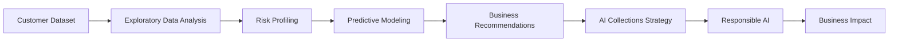
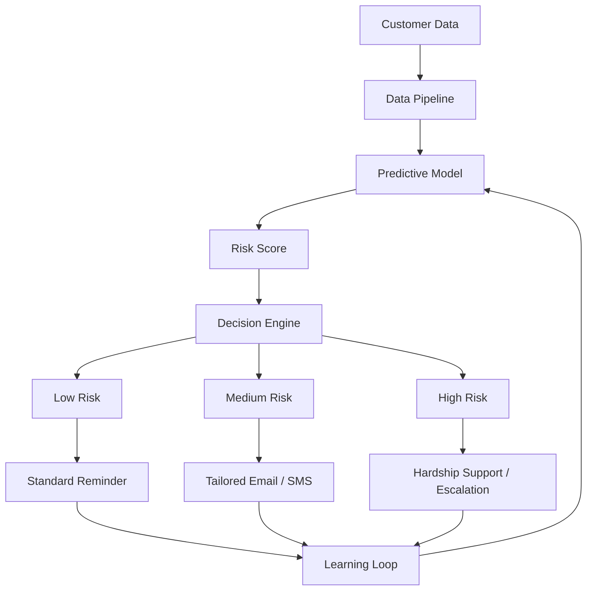

<p align="center">

# 💳 AI-Powered Credit Card Delinquency Prediction & Autonomous Collections Strategy

### *Tata iQ GenAI Powered Data Analytics — Forage Job Simulation*

*Certification exercise completed on Forage — not a real client engagement*

<br>


-1E2761?style=for-the-badge)
-CADCFC?style=for-the-badge&logoColor=black)
-blue?style=for-the-badge)


</p>

<p align="center">
  <a href="#-what-this-is">Overview</a> •
  <a href="#-business-problem">Problem</a> •
  <a href="#-key-findings">Findings</a> •
  <a href="#-ai-collections-system-architecture">Architecture</a> •
  <a href="#-project-deliverables">Deliverables</a> •
  <a href="#-technology-stack">Tech Stack</a>
</p>

<p align="center">

📄 <a href="docs/Task1_EDA_Summary_Report.pdf">EDA Report</a> •
📈 <a href="docs/Task2_Predictive_Model_Plan.pdf">Predictive Model</a> •
📑 <a href="docs/Task3_Business_Summary_Report.pdf">Business Report</a> •
📊 <a href="presentation/Task4_AI_Collections_Strategy.pptx">Presentation</a>

</p>

---

## 📌 What This Is

This repository is my completed submission for the **Tata iQ GenAI Powered Data Analytics Job Simulation**, a self-paced certification program hosted on **Forage**.

**This is not a real consulting engagement.** "Geldium Finance" is a fictional company created by Forage for the simulation, and the dataset is a provided sample dataset — not real customer data from any actual business. I completed the four tasks as a self-directed learner earning a completion certificate, not as part of an employer engagement.

**How this was actually built:** Forage's own task brief for the modeling step only asks for GenAI-generated pseudo-code (no execution required) — see Forage's official example answer, which stops at a conceptual outline. The Python analysis was generated using GenAI tools (Claude and ChatGPT) based on my prompts. I reviewed the outputs, validated the results, interpreted the findings, and prepared the final business recommendations. The numbers throughout this README (AUC, delinquency rates, segment sizes) are genuine output from that workflow, not estimates or Forage's template figures.

---

## 🎯 Business Problem

Geldium Finance is experiencing increasing credit card delinquency due to:

| Challenge | Impact |
|---|---|
| Manual collections processes | Slow, inconsistent outreach |
| Static customer segmentation | Misses compounding risk factors |
| Reactive customer outreach | Interventions arrive too late |
| Limited personalization | One-size-fits-all messaging |
| Inefficient prioritization | High-risk customers not flagged early |

**Project Objectives**

- Analyze customer data through Exploratory Data Analysis (EDA)
- Identify major delinquency risk factors
- Design a predictive modeling approach
- Develop business recommendations
- Propose an AI-powered autonomous collections framework
- Ensure Responsible AI and regulatory compliance

---

## 🔄 Project Workflow



---

## 📊 Key Findings

This project intentionally reports the analytical results exactly as observed — even when they are weaker than expected.

| Finding | Result |
|---|---|
| Dataset Size | 500 customers |
| Delinquency Rate | 16.0% |
| Missing Values | Income (7.8%), Loan Balance (5.8%), Credit Score (0.4%) |
| Data Quality Issues | Employment Status inconsistencies, Credit Utilization >100% |
| Strongest Risk Segment | Unemployed + DTI ≥ 35% → **30.4% delinquency** (n=23) |
| Logistic Regression Performance | Mean ROC-AUC = **0.443** (5-fold CV) |
| XGBoost Comparison | Mean ROC-AUC = **0.375** — underperformed Logistic Regression |

> **Key observation:** The predictive model demonstrated limited predictive performance (AUC = 0.443), and a gradient-boosted alternative (XGBoost) was tested as a follow-up but performed worse (AUC = 0.375) — indicating the weak signal is a data-size/noise issue rather than something a more flexible algorithm could recover. Instead of overstating the model's capability, this project recommends using **transparent, segment-based business rules with human oversight** until a stronger predictive model can be developed on larger production datasets.

## 📈 Project Outcome

Although the Logistic Regression model achieved a modest ROC-AUC of **0.443** (and a follow-up XGBoost comparison performed even worse, at 0.375), the project successfully identified meaningful business segments through exploratory and combined-segment interaction analysis.

Rather than recommending deployment of an unreliable predictive model, the final solution proposes a transparent, human-supervised collections strategy using high-risk customer segmentation supported by Responsible AI principles.

---

## 🏗 AI Collections System Architecture



---

## 🤖 Agentic AI Workflow

<table>
<tr>
<td valign="top" width="50%">

**🟢 Autonomous Activities**
- Customer monitoring
- Risk prediction
- Personalized reminders
- Continuous learning
- Recommendation generation

</td>
<td valign="top" width="50%">

**🔴 Human Oversight Required**
- Hardship approval
- Debt restructuring
- Compliance review
- Legal escalation
- High-impact decisions

</td>
</tr>
</table>

---

## 📁 Repository Structure

```
Tata-GenAI-Credit-Card-Delinquency-Prediction
│
├── README.md
│
├── docs/
│   ├── Task1_EDA_Summary_Report.pdf
│   ├── Task2_Predictive_Model_Plan.pdf
│   └── Task3_Business_Summary_Report.pdf
│
├── presentation/
│   └── Task4_AI_Collections_Strategy.pptx
│
└── certificate/
    └── Tata_Forage_Certificate.pdf
```

---

## 📄 Project Deliverables

| Task | Focus | Highlights |
|---|---|---|
| ✅ **Task 1** — EDA | Data quality & risk profiling | Missing value analysis, correlation analysis, combined-segment interaction analysis |
| ✅ **Task 2** — Predictive Modeling | Logistic Regression + XGBoost comparison | 5-fold cross-validation, honest AUC reporting, non-linear model tested and found not to help, Responsible AI considerations |
| ✅ **Task 3** — Business Report | Executive strategy | SMART action plan, KPI framework, phased roadmap |
| ✅ **Task 4** — AI Collections Strategy | Agentic AI design | Human-in-the-loop framework, Responsible AI guardrails, business impact |

---

## 🛡 Responsible AI

The proposed solution follows Responsible AI principles:

`Fairness` · `Explainability` · `Human Oversight` · `Transparency` · `Audit Logging` · `Continuous Monitoring` · `GDPR Awareness` · `ECOA Compliance` · `FCRA Alignment` · `FCA Principles`

---

## 💻 Technology Stack

**AI-assisted Python implementation (pandas, NumPy, scikit-learn, XGBoost) generated with Claude and ChatGPT, followed by review and validation of the results.**

| Category | Tools |
|---|---|
| **Analytics** | Python, pandas, NumPy |
| **Machine Learning** | scikit-learn, Logistic Regression, XGBoost |
| **AI Strategy** | Agentic AI, Responsible AI |
| **Documentation** | Markdown, Mermaid, MS Word, PowerPoint |
| **GenAI Assistance** | Claude, ChatGPT |

---

## 🎯 Skills Demonstrated

- AI-assisted Exploratory Data Analysis
- Data Cleaning & Validation
- Predictive Model Evaluation
- Logistic Regression
- XGBoost Comparison
- Cross Validation
- Business Analytics
- Data Storytelling
- Executive Reporting
- Responsible AI
- Stakeholder Communication

---

## 📄 License

This repository is released under the MIT License.

## 🙏 Acknowledgements

- Tata iQ
- Forage
- Geldium Finance (Simulated Client)

---

## 📜 Disclaimer

This repository represents work completed as part of the **Tata iQ GenAI Powered Data Analytics Job Simulation** on **Forage**. It is a certification/portfolio exercise, not a real business engagement: "Geldium Finance" is a fictional company invented for the simulation, and the dataset is a provided sample rather than real customer records. Forage's own baseline task brief did not require executing real code (see their example answer, which is pseudo-code only) — the analysis, model, and figures in this repository were produced using GenAI tools (Claude, ChatGPT) to generate and run the Python workflow, with my own review, validation, and interpretation of the results. This repository should be viewed as a learning and portfolio project demonstrating AI-assisted analytical workflows rather than production-ready or client-delivered work.

---

<p align="center">

**Tata iQ GenAI Powered Data Analytics • Forage Job Simulation • Certification Portfolio Project**

</p>
