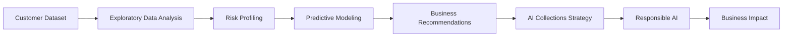
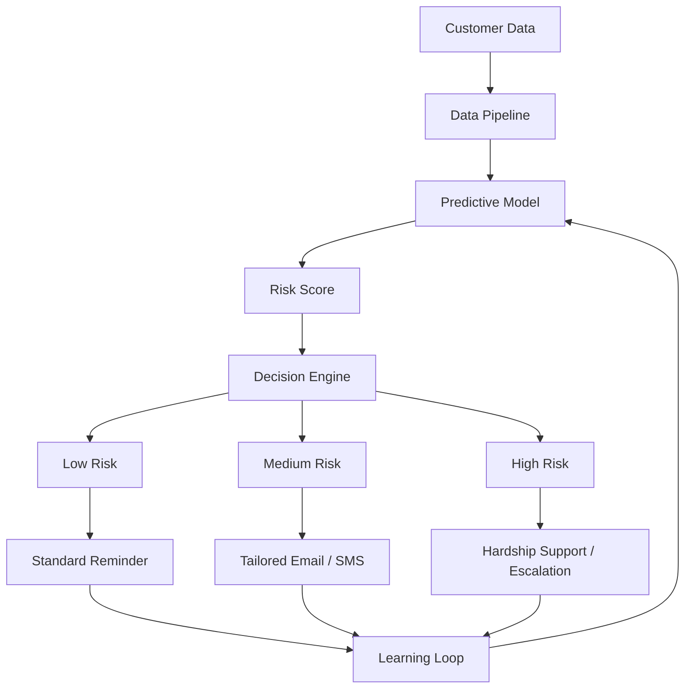

<p align="center">

# AI-Powered Credit Card Delinquency Prediction & Autonomous Collections Strategy

**Tata iQ GenAI Powered Data Analytics – Forage Virtual Experience**

*A simulated AI transformation consulting engagement for Geldium Finance.*


-CADCFC)


</p>

---

## 📌 Project Overview

This repository contains my submission for the **Tata iQ GenAI Powered Data Analytics Virtual Experience Program** on **Forage**.

In this simulated consulting engagement, I worked as an **AI Transformation Consultant** to help **Geldium Finance** address rising credit card delinquency through data analytics, predictive modeling, business recommendations, and an AI-powered collections strategy.

> **Note:** This project is based on a **simulated business case and dataset** provided by the Forage virtual experience. All findings and recommendations are derived from that dataset.

---

# 🎯 Business Problem

Geldium Finance is experiencing increasing credit card delinquency due to:

- Manual collections processes
- Static customer segmentation
- Reactive customer outreach
- Limited personalization
- Inefficient prioritization of high-risk customers

### Project Objectives

- Analyze customer data through Exploratory Data Analysis (EDA)
- Identify major delinquency risk factors
- Design a predictive modeling approach
- Develop business recommendations
- Propose an AI-powered autonomous collections framework
- Ensure Responsible AI and regulatory compliance

---

# 🔄 Project Workflow



---

# 📊 Key Findings

This project intentionally reports the analytical results **exactly as observed**, even when they are weaker than expected.

| Finding | Result |
|---------|---------|
| Dataset Size | 500 Customers |
| Delinquency Rate | 16% |
| Missing Values | Income & Loan Balance |
| Data Quality Issues | Employment Status inconsistencies, Credit Utilization >100% |
| Strongest Risk Segment | Unemployed + High Debt-to-Income Ratio |
| Logistic Regression Performance | Mean ROC-AUC = **0.44** |

### Key Observation

The predictive model demonstrated **limited predictive performance (AUC = 0.44)**.

Instead of overstating the model's capability, this project recommends using **transparent business rules and human oversight** until a stronger predictive model can be developed using larger production datasets.

---

# 🏗 AI Collections System Architecture



---

# 🤖 Agentic AI Workflow

### Autonomous Activities

- Customer monitoring
- Risk prediction
- Personalized reminders
- Continuous learning
- Recommendation generation

### Human Oversight

- Hardship approval
- Debt restructuring
- Compliance review
- Legal escalation
- High-impact decisions

---

# 📁 Repository Structure

```
Tata-GenAI-Credit-Card-Delinquency-Prediction

│
├── README.md
│
├── docs/
│   ├── Task1_EDA_Summary_Report.pdf
│   ├── Task2_Predictive_Model_Plan.pdf
│   └── Task3_Business_Summary_Report.pdf
│
├── presentation/
│   └── Task4_AI_Collections_Strategy.pptx
│
├── certificate/
│   └── Tata_Forage_Certificate.pdf
```

---

# 📄 Project Deliverables

### ✅ Task 1

Exploratory Data Analysis

- Data quality assessment
- Missing value analysis
- Correlation analysis
- Risk profiling

---

### ✅ Task 2

Predictive Modeling

- Logistic Regression
- Model evaluation
- Cross-validation
- Responsible AI considerations

---

### ✅ Task 3

Business Report

- Executive summary
- Business recommendations
- SMART action plan
- KPI framework

---

### ✅ Task 4

AI Collections Strategy

- Agentic AI architecture
- Human-in-the-loop framework
- Responsible AI guardrails
- Business impact

---

# 🛡 Responsible AI

The proposed solution follows Responsible AI principles:

- Fairness
- Explainability
- Human Oversight
- Transparency
- Audit Logging
- Continuous Monitoring
- GDPR Awareness
- ECOA Compliance
- FCRA Alignment
- FCA Principles

---

# 💻 Technology Stack

### Analytics

- Python
- pandas
- NumPy
- scikit-learn

### AI

- Logistic Regression
- Decision Trees (conceptual)
- Neural Networks (conceptual)
- Agentic AI

### Documentation

- Microsoft Word
- Microsoft PowerPoint
- Markdown
- Mermaid

### GenAI

- Claude
- ChatGPT

---

# 🎯 Skills Demonstrated

- Exploratory Data Analysis
- Data Cleaning
- Feature Engineering
- Predictive Analytics
- Logistic Regression
- Cross Validation
- Business Analytics
- Data Storytelling
- Executive Reporting
- AI Strategy
- Agentic AI
- Responsible AI
- Financial Analytics
- Stakeholder Communication

---

# 🚀 Future Improvements

- Train advanced models such as Gradient Boosting and XGBoost
- Improve feature engineering
- Validate using production-scale datasets
- Develop a Streamlit dashboard
- Integrate automated bias monitoring
- Deploy a real-time AI collections assistant

---

# 📜 Disclaimer

This repository represents work completed as part of the **Tata iQ GenAI Powered Data Analytics Virtual Experience** on **Forage**.

The project is based on a simulated business case and should be considered a portfolio demonstration rather than a production deployment.

---

<p align="center">

**Tata iQ GenAI Powered Data Analytics • Forage Virtual Experience • Portfolio Project**

</p>
