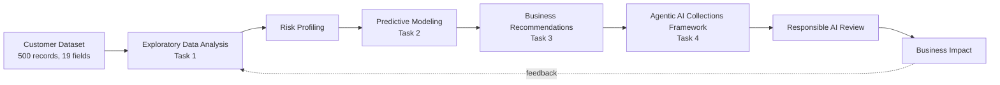
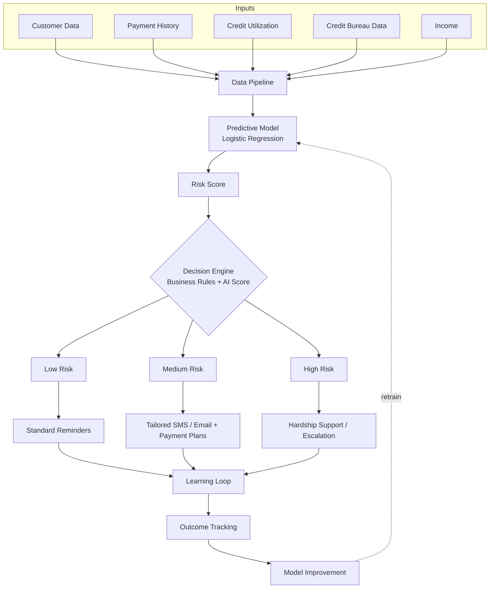
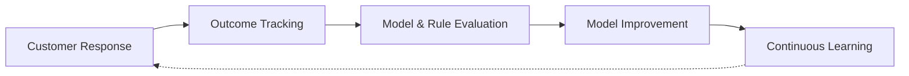
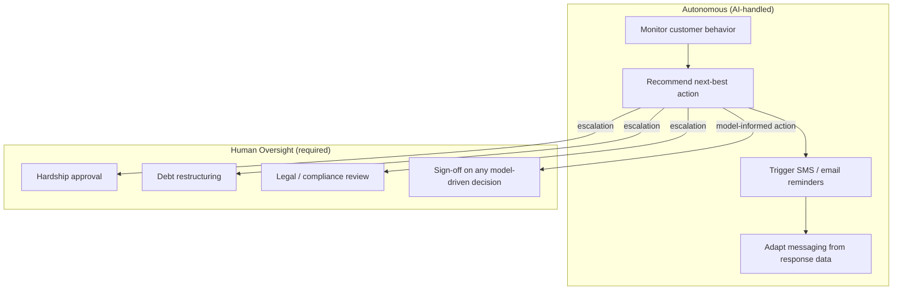

<p align="center">
  
</p>

<p align="center">
  
  
  
  
  
</p>

# AI-Powered Credit Card Delinquency Prediction & Autonomous Collections Strategy

**Tata iQ GenAI Powered Data Analytics — Forage Virtual Experience**
*A simulated AI-transformation consulting engagement for Geldium Finance.*

> ⚠️ **This is a Forage virtual experience project**, built on a provided simulated dataset. It is not a real client engagement. Every metric in this repository (delinquency rates, correlations, model AUC) is computed directly from the provided 500-row dataset — including where the results are weaker than a polished case study might prefer. See [Honest Findings](#-honest-findings-worth-reading) below.

---

## 📋 Table of Contents

- [Business Problem](#-business-problem)
- [Project Flow](#-project-flow)
- [Honest Findings](#-honest-findings-worth-reading)
- [Architecture](#-agentic-ai-architecture)
- [Repository Structure](#-repository-structure)
- [Deliverables](#-deliverables)
- [Responsible AI](#-responsible-ai)
- [Technology Stack](#-technology-stack)
- [Skills Demonstrated](#-skills-demonstrated)
- [Future Improvements](#-future-improvements)

---

## 🎯 Business Problem

Geldium Finance faces rising credit card delinquency, driven by:

- Manual, reactive collections processes
- Static customer segmentation
- Poor prioritization of at-risk accounts
- Limited personalization in outreach

**Goals of this engagement:** predict delinquency risk, prioritize collections intelligently, automate routine outreach, improve customer experience, and do all of it under Responsible AI and regulatory guardrails (GDPR, ECOA, FCRA, FCA).

---

## 🔄 Project Flow



---

## 🔍 Honest Findings (worth reading)

Most portfolio write-ups of exercises like this present tidy, confident results. This one doesn't, because the data doesn't support that — and that distinction is itself the point of doing real EDA before modeling.

| Finding | Detail |
|---|---|
| **Overall delinquency rate** | 16.0% (80 of 500 customers) |
| **Data quality issues found** | `Employment_Status` inconsistently encoded ("Employed" / "employed" / "EMP"); 4 records with Credit_Utilization above 100% |
| **Feature correlations with delinquency** | All under **0.05** in magnitude — no single feature is a strong linear driver |
| **Best-performing segment split found** | Unemployed + DTI ≥ 35% → **30.4%** delinquency rate (vs. 16.0% overall), on a small sub-sample of 23 customers |
| **Logistic regression, 5-fold CV** | Mean **AUC = 0.44** — at or slightly below chance (0.50) |

**What this means:** the tested model isn't reliable enough yet to drive automated decisions. The business recommendation (Task 3) and the collections architecture (Task 4) are therefore built around **transparent, auditable segment rules** rather than a model risk score, with a clear path to revisit modeling once validated on a larger or real production dataset. Reporting a null/weak result honestly, and adapting the recommendation around it, is treated here as more valuable than a more impressive-looking but unsupported narrative.

---

## 🏗 Agentic AI Architecture



**Learning loop:**



**Autonomous vs. human-in-the-loop:**



*(Raw diagram source files are in [`/diagrams`](diagrams/) as `.mmd` files.)*

---

## 📁 Repository Structure

```
Tata-GenAI-Powered-Data-Analytics/
│
├── README.md
├── LICENSE
├── data/
│   └── Delinquency_prediction_dataset.xlsx
│
├── docs/
│   ├── Task1_EDA_Summary_Report.docx
│   ├── Task2_Predictive_Model_Plan.docx
│   └── Task3_Business_Summary_Report.docx
│
├── presentation/
│   └── Task4_AI_Collections_Strategy.pptx
│
├── diagrams/
│   ├── architecture.mmd
│   ├── workflow.mmd
│   ├── learning_loop.mmd
│   └── agentic_ai.mmd
│
├── assets/
│   ├── banner.svg
│   └── screenshots/
│
├── prompts/
│   └── prompts_used.md
│
└── certificate/
    └── (add your Tata Forage completion certificate here)
```

---

## 📦 Deliverables

| Task | Deliverable | Summary |
|---|---|---|
| **1** | [EDA Summary Report](docs/Task1_EDA_Summary_Report.docx) | Missing data, data quality issues, correlation analysis, segment-level risk patterns — computed directly from the dataset |
| **2** | [Predictive Model Plan](docs/Task2_Predictive_Model_Plan.docx) | Logistic regression built and cross-validated in Python; honest evaluation (AUC 0.44) with a path forward |
| **3** | [Business Summary Report](docs/Task3_Business_Summary_Report.docx) | SMART recommendation targeting the highest-risk segment found in the data |
| **4** | [AI Collections Strategy Deck](presentation/Task4_AI_Collections_Strategy.pptx) | 8-slide deck: architecture, agentic AI roles, responsible AI guardrails, model status, business impact |

---

## 🛡 Responsible AI

- **Fairness** — segment rules and model outputs monitored across Employment_Status, Age, and Income bands for disparate impact
- **Explainability** — logistic regression coefficients and transparent segment thresholds, not a black-box score, drive current decisions
- **Human-in-the-loop** — required for hardship approval, debt restructuring, legal escalation, and any action informed by the model while its AUC remains near chance level
- **Compliance** — designed with GDPR, ECOA, FCRA, and FCA in mind
- **Audit logs & continuous monitoring** — every automated action and model retrain should be logged for review

---

## 🧰 Technology Stack

**Analysis:** Python (pandas, scikit-learn) for EDA and model training/cross-validation
**Modeling:** Logistic Regression (primary); Decision Tree and Neural Network considered as alternatives
**GenAI:** Claude — analysis structuring, documentation, and repository generation
**Documentation:** Word (.docx), PowerPoint (.pptx), Markdown, Mermaid diagrams

---

## 🎓 Skills Demonstrated

Exploratory Data Analysis · Data Cleaning & Quality Assessment · Risk Profiling · Predictive Analytics · Logistic Regression · Cross-Validation · Business Analytics · Data Storytelling · Stakeholder Communication · AI Strategy · Agentic AI Design · Responsible AI · Financial Analytics · Executive Reporting

---

## 🚀 Future Improvements

- Re-test with non-linear models (gradient boosting) and engineered interaction terms (e.g., DTI × Employment Status) to check whether the weak linear signal masks a real non-linear relationship
- Validate against a larger, real production dataset before any live deployment
- Build a live dashboard (e.g., Streamlit) for the segment-rules-based risk view
- Add automated bias-audit reporting across protected segments as part of the learning loop

---

<p align="center"><i>Tata iQ GenAI Powered Data Analytics · Forage Virtual Experience · Simulated Client Engagement</i></p>
